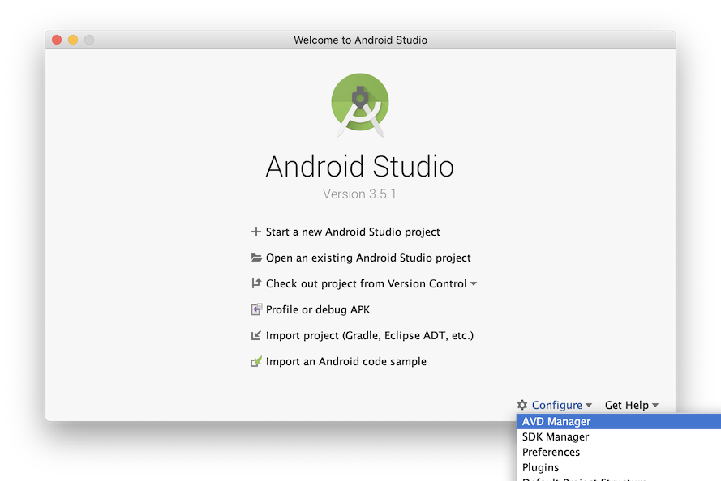
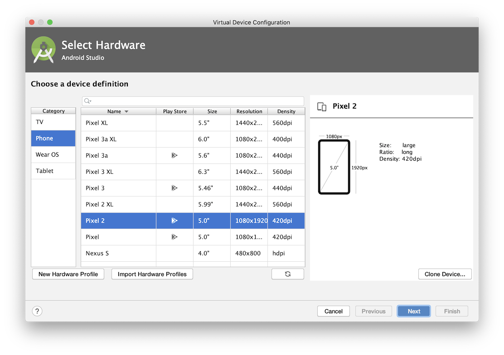
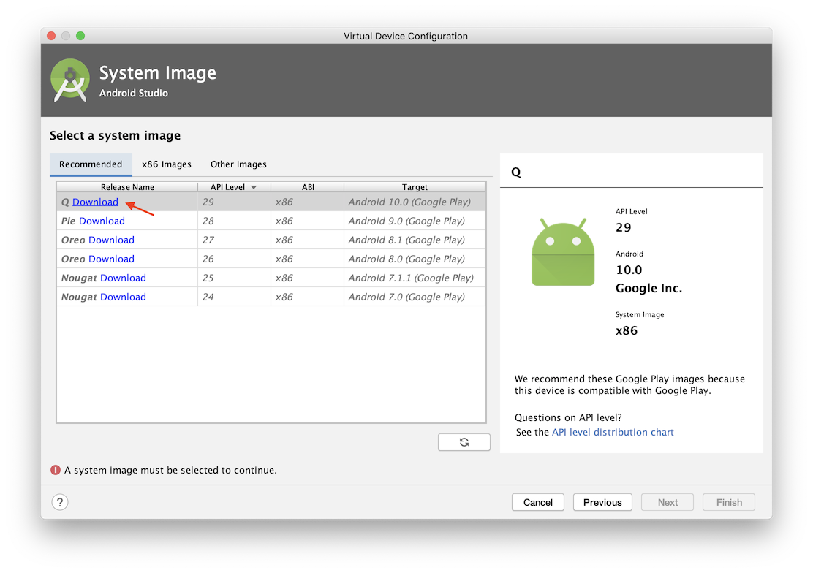
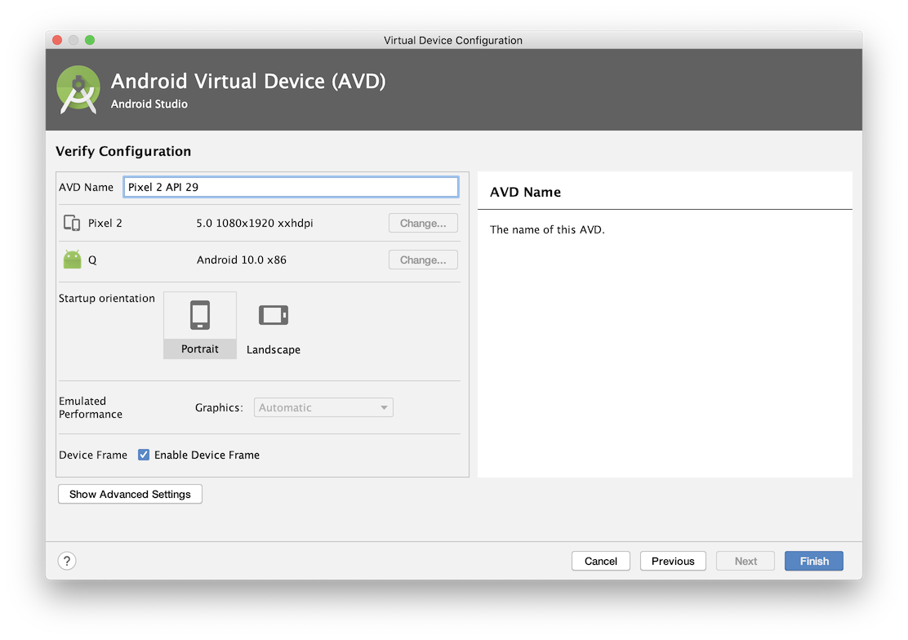
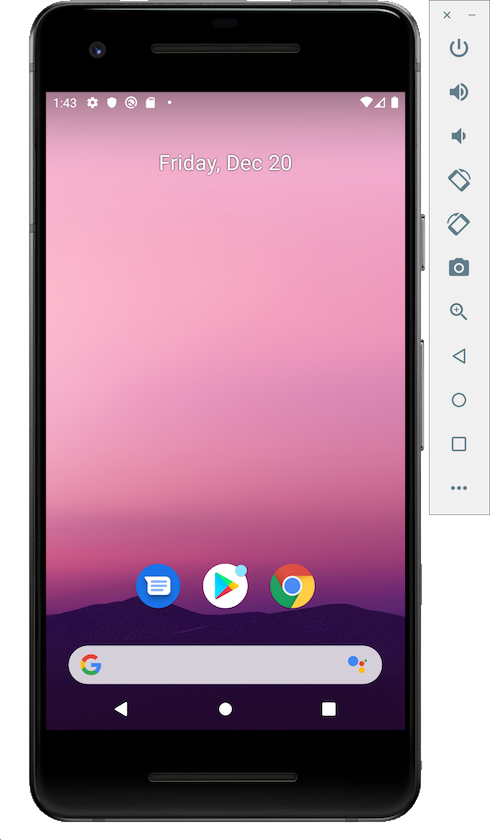
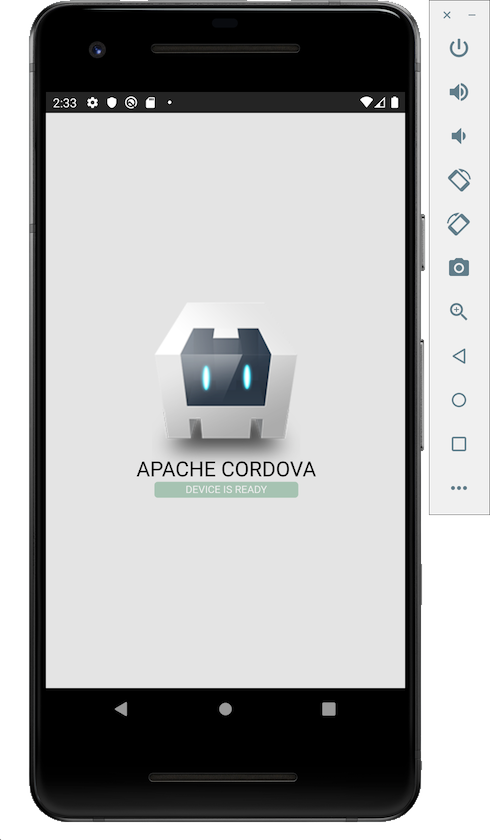
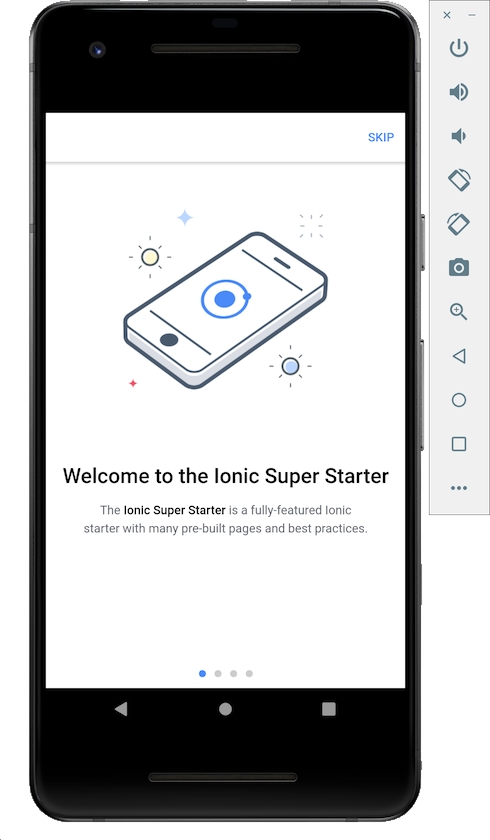
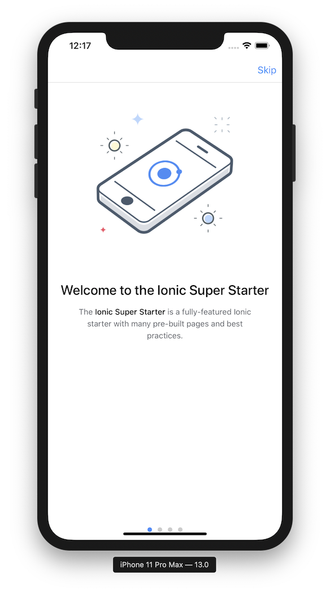

<!-- to generate toc:
  npm install -g markdown-toc
  markdown-toc -i [this file]
-->

<!-- toc -->

- [Intro](#intro)
- [Package Managers](#package-managers)
- [Android Dependencies](#android-dependencies)
  - [Java 8](#java-8)
  - [Gradle](#gradle)
- [Android SDK](#android-sdk)
  - [Command line tools](#command-line-tools)
    - [Further Reading](#further-reading)
  - [Android Emulator](#android-emulator)
- [iOS](#ios)
  - [XCode](#xcode)
- [Apache Cordova](#apache-cordova)
  - [Install Node.js](#install-nodejs)
  - [Install Cordova](#install-cordova)
  - [Requirements](#requirements)
  - [Build](#build)
  - [Further Reading](#further-reading-1)
- [Ionic](#ionic)
  - [Android](#android)
  - [iOS](#ios-1)
  - [Further Reading](#further-reading-2)

<!-- tocstop -->

# Intro

This guide should get you setup to build Apache Cordova and Ionic mobile apps
on your Windows or Linux/OSX operating system for Android and iOS platforms. It
takes a step by step approach so you can become familiar with the command line
tools and understand how all the various technologies fit together. It is
tested with `bash` but should work in `zsh` and other command shells with minor
adjustments.

If you notice a particular incompatibility with your system [please create an
issue](https://github.com/mandric/Apache-Cordova-and-Ionic-Setup/issues)
or merge request in the Gitlab project so this document stays updated and
works for common environments.

# Package Managers

Unless you manually manage your system packages we recommend installing
a package manager:

- On OSX [install Homebrew](http://brew.sh/)
- On Windows [install Chocolatey]()

# Android Dependencies

The following are required by the Android SDK:

## Java 8

Check if you have Java JDK or JRE version 8 (1.8.x) installed:

```shell
$ java -version
openjdk version "1.8.0_222"
OpenJDK Runtime Environment (AdoptOpenJDK)(build 1.8.0_222-b10)
OpenJDK 64-Bit Server VM (AdoptOpenJDK)(build 25.222-b10, mixed mode)
```

Or install it:

Windows [todo]

OSX comes pre-installed with Java 8 but if you are
running a different version you can install using brew:

```
brew tap AdoptOpenJDK/openjdk
brew cask install adoptopenjdk8
```

## Gradle

Check if you have Gradle installed:

```shell
$ gradle -version

------------------------------------------------------------
Gradle 6.0.1
------------------------------------------------------------

Build time:   2019-11-18 20:25:01 UTC
Revision:     fad121066a68c4701acd362daf4287a7c309a0f5

Kotlin:       1.3.50
Groovy:       2.5.8
Ant:          Apache Ant(TM) version 1.10.7 compiled on September 1 2019
JVM:          1.8.0_222 (AdoptOpenJDK 25.222-b10)
OS:           Mac OS X 10.15.1 x86_64
```

Or install it:

Windows: [todo]

OSX:

```
brew install gradle
```

# Android SDK

Install [Android Studio](https://developer.android.com/studio/index.html)
then launch it to guide you through the installation:

Accept the defaults and select Finish:


## Command line tools

During installation some environment variables are setup automatically in
your command shell. Lets confirm they are correct and your shell has the
updated values:

```shell
source ~/.bash_profile
```

Check if your shell has these variable set:

```shell
$ echo $ANDROID_SDK_ROOT
/Users/[your user]/Library/Android/sdk/
```

Confirm the following directory structure (using quotes in case your path has
special characters):

```shell
$ ls "$ANDROID_SDK_ROOT"
build-tools    extras         patcher        platforms      sources        tools
emulator       licenses       platform-tools skins          system-images
```

Verify your `~/.bash_profile` includes the command line tools in your `PATH`
environment variable:

```bash
# Default Android Studio install path on iOS, yours might be different.
export ANDROID_SDK_ROOT='/Users/[your user]/Library/Android/sdk'
# ANDROID_HOME is deprecated but uncomment if you have old projects that need it.
# export ANDROID_HOME="$ANDROID_SDK_ROOT"
export PATH="$PATH:$ANDROID_SDK_ROOT/tools/bin:$ANDROID_SDK_ROOT/platform-tools:$ANDROID_SDK_ROOT/emulator:$ANDROID_SDK_ROOT/build-tools"
```

Then run `source ~/.bash_profile` again to apply the changes to your current
shell.

Once your `PATH` is setup correctly, verify your installation:

```shell
$ adb devices
* daemon not running; starting now at tcp:5037
* daemon started successfully
List of devices attached
```

```shell
$ sdkmanager --version
26.1.1
```

List your installed packages:

```shell
$ sdkmanager --list | sed '/Available\ Packages/q'
Installed packages:
  Path                                                | Version | Description                                     | Location
  -------                                             | ------- | -------                                         | -------
  build-tools;29.0.2                                  | 29.0.2  | Android SDK Build-Tools 29.0.2                  | build-tools/29.0.2/
  emulator                                            | 29.3.0  | Android Emulator                                | emulator/
  extras;intel;Hardware_Accelerated_Execution_Manager | 7.5.1   | Intel x86 Emulator Accelerator (HAXM installer) | extras/intel/Hardware_Accelerated_Execution_Manager/
  patcher;v4                                          | 1       | SDK Patch Applier v4                            | patcher/v4/
  platform-tools                                      | 29.0.5  | Android SDK Platform-Tools                      | platform-tools/
  platforms;android-29                                | 4       | Android SDK Platform 29                         | platforms/android-29/
  sources;android-29                                  | 1       | Sources for Android 29                          | sources/android-29/
  system-images;android-29;google_apis_playstore;x86  | 8       | Google Play Intel x86 Atom System Image         | system-images/android-29/google_apis_playstore/x86/
  tools                                               | 26.1.1  | Android SDK Tools                               | tools/
```

Verify the emulator and avdmanager are available as well:

```shell
$ emulator -version
Android emulator version 29.3.0.0 (build_id 6061023) (CL:N/A)
Copyright (C) 2006-2017 The Android Open Source Project and many others.
...
```

```shell
$ emulator -help
Android Emulator usage: emulator [options] [-qemu args]
  options:
...
```

```shell
$ avdmanager -h

Usage:
      avdmanager [global options] [action] [action options]
      Global options:
  -s --silent     : Silent mode, shows errors only.
  -v --verbose    : Verbose mode, shows errors, warnings and all messages.
     --clear-cache: Clear the SDK Manager repository manifest cache.
  -h --help       : Help on a specific command.
...
```

### Further Reading

- [Environment Variables, Android Developers](https://developer.android.com/studio/command-line/variables)
- [Command line tools, Android Developers](https://developer.android.com/studio/command-line)

## Android Emulator

Though running an emulator is optional because you can also use an actual
device, it's convenient to have one.

To start using the emulator you need to create an AVD (Android Virtual Device).

Choose `AVD Manager` from the welcome screen or from an existing project window use the `Tools` menu.



Choose your Hardware Device, if you are not sure then the defaults should be fine:



On the System Image screen select Download for the latest recommended image.

The emulator system images are quite large, 1.1GB at the time of this
writing, so it helps if you have a good internet connection.



Once the image is downloaded select it and choose Next.

Finally name your AVD and click Finish:

## Table of Contents

Now when you run the emulator command to list AVDs you should see the one you created:

```shell
$ emulator -list-avds
Pixel_2_API_29
```

Launching it from the command line should provide you with a usable emulator:

```
emulator -avd Pixel_2_API_29
```



⭐️ Great, your Android environment should be ready to go!

# iOS

## XCode

First install [XCode from the App
Store](https://itunes.apple.com/us/app/xcode/id497799835?mt=12).

Once Xcode is installed, also enable the command line tools:

```
xcode-select --install
```

# Apache Cordova

[Apache Cordova](https://cordova.apache.org/) provides a framework for native
apps on iOS and Android, and bundles a command line interface named `cordova`.

## Install Node.js

Check if you have the LTS version (v12 at the time of this writing) installed:

```shell
$ node --version
v12.13.1
```

Or install it:

Since Node.js moves pretty quickly and we are using it for development, we
might need to test against different versions, we recommend using
[nvm](https://github.com/nvm-sh/nvm).

[Install nvm](https://github.com/nvm-sh/nvm#installation-and-update) then
test the installation:

```shell
$ nvm -h

Node Version Manager (v0.35.2)
...
```

If the above fails with "command not found" try `source ~/.bash_profile` before
you run it.

Then install Node.js with nvm:

```
# "node" is an alias for the latest version
nvm install node
```

## Install Cordova

Check if you have a recent version of Cordova:

```shell
$ cordova -version
9.0.0 (cordova-lib@9.0.1)
```

Or install it:

```
npm install -g cordova
```

## Requirements

Lets try to build a test app to see if all requirements are met:

Create a hello world boilerplate:

```shell
$ cordova create hello com.example.hello HelloWorld
Creating a new cordova project.
$ cd hello
$ cordova platform add ios
$ cordova platform add android
```

The project should now have two platforms configured:

```shell
$ cordova platform ls
Installed platforms:
  android 8.1.0
  ios 5.1.1
```

Now check if the Cordova requirements are met:

```shell
$ cordova requirements
Requirements check results for android:
Java JDK: installed 1.8.0
Android SDK: installed true
Android target: not installed
Please install Android target / API level: "android-28".

Hint: Open the SDK manager by running: /Users/mandric/Library/Android/sdk/tools/android
You will require:
1. "SDK Platform" for API level android-28
2. "Android SDK Platform-tools (latest)
3. "Android SDK Build-tools" (latest)
Gradle: installed /usr/local/Cellar/gradle/6.0.1/bin/gradle

Requirements check results for ios:
Apple macOS: installed darwin
Xcode: installed 11.0
ios-deploy: not installed
ios-deploy was not found. Please download, build and install version 1.9.2 or greater from https://github.com/ios-control/ios-deploy into your path, or do 'npm install -g ios-deploy'
CocoaPods: not installed
CocoaPods was not found. Please install version 1.0.1 or greater from https://cocoapods.org/
Some of requirements check failed
```

We installed the latest platform of Android 29, but Cordova is still using Android 28, let's install it:

```
sdkmanager --install 'platforms;android-28'
```

Now check the requirements again:

```
cordova requirements
```

We are still missing a few things.

Install ios-deploy:

```
npm install -g ios-deploy
```

Install CocoaPods (Ruby Gem):

```
sudo gem install cocoapods
```

Run the requirements check again:

```
$ cordova requirements

Requirements check results for android:
Java JDK: installed 1.8.0
Android SDK: installed true
Android target: installed android-29,android-28
Gradle: installed /usr/local/Cellar/gradle/6.0.1/bin/gradle

Requirements check results for ios:
Apple macOS: installed darwin
Xcode: installed 11.0
ios-deploy: installed 1.10.0
CocoaPods: installed 1.8.4
```

⭐️ Great, the requirements to build Apache Cordova apps are met!

## Build

To build on all configured platforms, run:

```
cordova build
```

This command takes a little while and produces the binaries you can run on
each platform.

You shoudl see <strong>** BUILD
SUCCEEDED **</strong> at the end unless something failed.

Now install the Android build on the emulator:

```
cordova emulate android
```

This automatically launches an Android AVD on the emulator and installs the
app:



If you are on OSX test iOS as well:

```
cordova emulate ios
```

You should also see the hello world app running in the iOS emulator:


⭐️ Congrats, you are ready to start building cross-platform apps with Apache Cordova!

## Further Reading

- [Architectural overview of Cordova platform, Apache Cordova](https://cordova.apache.org/docs/en/latest/guide/overview/index.html)
- [Android Platform Guide, Apache Cordova](https://cordova.apache.org/docs/en/latest/guide/platforms/android/index.html)
- [iOS Platform Guide, Apache Cordova](https://cordova.apache.org/docs/en/latest/guide/platforms/ios/index.html)

# Ionic

[Ionic](https://ionicframework.com) provides a platform for developing mobile
and web apps.

Install the `ionic` command line interface:

```
npm install -g ionic
```

Then create a starter app, this will initialize a new project using the
`super` app template, in the directory `hello-ionic`:

```
ionic start hello-ionic super --type=ionic-angular
```

## Android

Add the Android build target to the Ionic project and build it:

```
cd hello-ionic
ionic cordova platform add android
ionic cordova build android
```

Now install the app on the Android emulator we setup previously:

```
ionic cordova emulate android
```

The emulator should launch (if it's not already running) and the build assets
are installed, then you should a similar screen like below. Quickly test the
app to see if it behaves properly.



## iOS

Add the iOS build target to the Ionic project and build it:

```
cd hello-ionic
ionic cordova platform add ios
ionic cordova build ios
```

Now install the app on the iOS emulator we setup previously:

```
ionic cordova emulate ios
```

The emulator should launch (if it's not already running) and the build assets
are installed, then you should a similar screen like below. Quickly test the
app to see if it behaves properly.



⭐️ Excellent, you're all set to start building cross platform apps with Ionic.

## Further Reading

- [iOS Setup - Ionic](https://ionicframework.com/docs/installation/ios)
- [Android Setup - Ionic](https://ionicframework.com/docs/installation/android)
